# Architecture Blueprint: Distributed Benchmarking & Hosting Platform

This system design document details the microservices architecture, data storage models, communication protocols, sandboxing boundaries, and infrastructure scaling plans for the IICPC Distributed Benchmarking and Hosting Platform.

---

## 1. System Topology & Flow

The system consists of five decoupled services that communicate via high-performance queues, pub/sub channels, and REST APIs.

```mermaid
sequenceDiagram
    autonumber
    actor User as Contestant / Judge
    participant Web as Dashboard UI & API
    participant Mgr as Sandbox Manager
    participant Dock as Docker / K8s Engine
    participant Red as Redis Store
    participant Load as Load Generator Fleet
    participant Sandbox as Contestant Sandbox

    User->>Web: Upload main.go
    Web->>Mgr: Forward file & team metadata
    Mgr->>Dock: Build & start sandbox container
    Dock-->>Mgr: Container active
    Mgr->>Web: Confirm active status
    User->>Web: Trigger stress test
    Web->>Red: Enqueue job ("test_jobs")
    Red->>Load: Pop job from queue
    Load->>Red: Publish "started" event
    Red-->>Web: Broadcast "started" via WS
    
    rect rgb(20, 30, 45)
        Note over Load, Sandbox: High-Velocity Load Loop
        loop Over duration_seconds
            Load->>Sandbox: Send orders (HTTP/WS)
            Sandbox-->>Load: Return executions
            Load->>Load: Audit fills & spread
            Load->>Red: Stream latency, TPS, errors
            Red-->>Web: Broadcast metrics via WS
            Web-->>User: Update live graphs (Chart.js)
        end
    end
    
    Load->>Red: Save Final score & Leaderboard rank
    Load->>Red: Publish "finished" event
    Red-->>Web: Broadcast "finished" via WS
    Web->>Mgr: Request container teardown
    Mgr->>Dock: Stop and remove sandbox

## 2. Microservices Decomposition

### 2.1 Sandbox Manager (Python/FastAPI)
- **Responsibility**: Container building, deployment, and lifecycle management.
- **Workflow**: Receives the Go matching engine source code, places it inside a secure build context, compiles it utilizing a caching Docker layer, and instantiates the container.
- **Isolation Enforcement**: Limits the container resources through low-level Docker API parameters: CPU quotas (`nano_cpus`), memory bounds (`mem_limit`), and network isolation configurations.

### 2.2 Distributed Load Generator (Go Bot Fleet)
- **Responsibility**: Concurrent traffic generation, real-time metrics calculation, and correctness auditing.
- **Bot Strategy**: Spawns multiple worker goroutines. The goroutines execute specific trading behaviors:
  - **Market Makers**: Continuously post limit orders to build bids and asks depth.
  - **Aggressive Takers**: Bombard the book with market orders to trigger executions.
  - **Noise Traders**: Submit random orders and cancels.
- **Correctness Auditor**: Operates two real-time auditors:
  1. *Spread Auditor*: Periodically inspects orderbook. If the book spread is crossed (Best Bid >= Best Ask), it indicates a match failure.
  2. *Trade Auditor*: Validates that execution fills align with price-time priority constraints.

### 2.3 Dashboard UI & WebSockets Server (Node.js/Express)
- **Responsibility**: Real-time HUD, leaderboard rendering, and WebSocket message relaying.
- **Workflow**: Serves a glassmorphism client. Integrates directly with Redis pub/sub. When the load generator publishes telemetry, the dashboard relays it to connected clients.

---

## 3. Data Architecture & Storage Strategy

The database layer utilizes a hot storage and pub/sub model to support extreme transaction speeds without bottlenecking the load generator.

```mermaid
graph LR
    subgraph RAM [In-Memory Storage - Redis]
        Queue[Jobs List: 'test_jobs']
        PubSub[Events PubSub: 'test_events' / 'live_metrics']
        LDB[Sorted Set Leaderboard: 'leaderboard']
        Cache[Hash Results: 'contestant_results']
    end
    
    subgraph Cold [Production Metrics Archive]
        TS[TimescaleDB / ClickHouse]
        Kafka[Redpanda / Kafka Buffer]
    end
    
    LoadGen[Load Generator] -->|LPush| Queue
    LoadGen -->|Publish| PubSub
    LoadGen -->|ZAdd| LDB
    LoadGen -->|HSet| Cache
    
    LoadGen -.->|Produce Raw Trades| Kafka
    Kafka -.->|Batch Write| TS
```

### 3.1 Redis Data Models
- **Queueing (`test_jobs`)**: A FIFO list. Jobs are enqueued by the Sandbox Manager via `LPUSH` and popped by the Load Generator worker via `BRPOP`.
- **Telemetry Streaming (`live_metrics` Channel)**: Real-time window data is published via `PUBLISH` to a telemetry stream. The dashboard server subscribes to it to enable WebSocket feeds.
- **State Store (`contestant_results`)**: A Redis Hash mapping `team_name` -> JSON string containing average TPS, p99 latency, success rate, and correctness stats.
- **Leaderboard Sorted Set (`leaderboard`)**: Scores are stored as sorted weights. Fetched instantly using `ZRANGE WITHSCORES`.

### 3.2 Scaling to Production (TimescaleDB / Kafka)
For production grading, streaming millions of raw matching responses to Redis can overload memory. We propose:
1. **Redpanda/Kafka event pipeline**: Load generators stream raw trade events to a Kafka topic.
2. **TimescaleDB ingestion**: A consumer pulls from Kafka and batch-writes to TimescaleDB (hypertable partitioned by timestamp) for historical analysis.

---

## 4. Concurrency & Performance Design

To generate thousands of orders per second without artificial latencies, the Load Generator is written in Go:
- **Lockless Accumulation**: Window metrics are tracked using lock-free atomic primitives (`sync/atomic`) for transaction counts.
- **Goroutine Pools**: Bots are represented as independent goroutines. Network connections utilize a shared, pre-allocated HTTP transport client pool to optimize TCP handshakes and reuse keep-alive connections.
- **Non-blocking Metrics Publishing**: Telemetry channels use buffered queues to ensure slow network writes to Redis do not block the active bot fleet loop.

---

## 5. Security & Isolation Strategy

Evaluations must be secure against malicious contestant submissions (e.g. infinite loops, network intrusion, file system tampering).

```mermaid
graph TD
    subgraph Host [Host VM OS]
        subgraph Net [Docker Network: benchmarking-net]
            Load[Load Generator]
        end
        
        subgraph Sandbox [Strict Sandbox Boundary]
            Contestant[Contestant Container]
        end
    end
    
    Load --->|Exposes Port 8080| Contestant
    Contestant -.->|BLOCKED| HostFS[Host File System]
    Contestant -.->|BLOCKED| ExtNet[External Internet]
    
    style Sandbox fill:#3b1d22,stroke:#f87171,stroke-width:2px
```



### 5.1 Sandbox Resource Limits
Contestant containers are strictly limited using standard Linux cgroups:
- **CPU Pinning (`--cpuset-cpus="0" --cpu-shares="512"`)**: Restricts the contestant to a single CPU core, preventing infinite loops in matching code from starving the host OS or other containers.
- **Memory Caps (`-m 256m --memory-swap="256m"`)**: Strictly allocates 256MB RAM. Exceeding this triggers an Out-Of-Memory (OOM) kill, which is caught and flagged as a submission crash.

### 5.2 Network Isolation
- **No External Outbound Access**: The contestant container has no access to the external internet. This prevents malicious binaries from executing reverse shells, loading remote code, or transmitting telemetry data outside the platform.
- **Restricted Bridge**: Ingress is permitted solely from the load-generator container on specified ports.

### 5.3 Production Sandbox (gVisor)
In production, standard Docker containers share the host Linux kernel, presenting security risks (privilege escalation, kernel exploits). We recommend deploying contestant containers with **gVisor (runsc)** or **Kata Containers**. gVisor intercepts syscalls in user-space, providing virtualization-grade isolation at container-like speeds.

---

## 6. Infrastructure & Cloud Deployment (IaC)

The platform is designed to run in a cloud-native Kubernetes environment (AWS EKS or GCP GKE) to scale dynamically with submission volume.

- **Horizontal Pod Autoscaling (HPA)**: The Load Generator is deployed as a stateless worker deployment. When multiple teams start stress tests, the Kubernetes HPA auto-scales the Load Generator replica set based on CPU/Memory usage.
- **Compute Partitioning**: Using Kubernetes **Taints and Tolerations**, we route contestant matching engines to a dedicated, cheaper "Spot Instance" node group, while the dashboard and Redis run on highly available "On-Demand" instances to guarantee uptime.

---

## 7. Transitioning to a Secure Public Cloud Deployment

To transition the local Docker-Compose prototype to a secure, public-facing cloud platform, we must address security isolation, identity, and traffic management.

```mermaid
graph TD
    User([Public User]) --->|HTTPS| ALB[AWS ALB]
    ALB --->|Auth Check| Cog[Cognito / API Gateway]
    Cog --->|Manage Jobs| SB[Sandbox Manager Pod]
    Cog --->|View UI| Dash[Dashboard Pods]
    
    SB --->|Launch Fargate Task| ECS[AWS ECS API]
    ECS --->|Runs isolated VM| Task[Contestant Fargate Task]
    
    Dash <---> Redis[(ElastiCache Redis)]
    LG[Load Generator Workers] <---> Redis
    
    LG --->|Stress Test| Task
    
    subgraph Isolated Subnet [Strict Private VPC Subnet]
        Task
    end
    
    style Task fill:#3b1d22,stroke:#f87171,stroke-width:2px
```



### 7.1 Hardening Contestant Sandboxing (AWS Fargate/Firecracker)
- **Local Vulnerability**: Sharing the Docker socket (`/var/run/docker.sock`) is a severe security risk in a public environment. An uploaded malicious matching engine could execute container escape scripts to access the host kernel.
- **Production Solution**: Instead of Docker, the Sandbox Manager should be modified to call the **AWS ECS API** to deploy each contestant engine as an independent **AWS Fargate task**. 
- **Under the Hood**: Fargate runs tasks in dedicated, lightweight MicroVMs (using **AWS Firecracker**). This provides hardware-level virtualization isolation. The matching engine shares no kernel with other tasks or host VMs.

### 7.2 Secure Network Architecture (VPC & Subnets)
- **Network Isolation**: The AWS Fargate tasks running contestant engines are deployed inside a dedicated **Isolated Private Subnet**.
- **Security Groups**: 
  - The contestant security group blocks all outbound traffic (`0.0.0.0/0`).
  - Ingress is restricted: only the Load Generator security group can access port `8080` of the contestant task.
- **VPC Endpoints**: Sandbox Manager uses private VPC endpoints to communicate with AWS APIs without routing traffic over the public internet.

### 7.3 Ingress & Transport Layer Security (TLS)
- **HTTPS & WSS Protocol**: All ingress traffic from user browsers must use HTTPS (port 443) and WebSockets Secure (WSS). 
- **AWS ALB**: An Application Load Balancer terminates TLS using certificates managed by AWS Certificate Manager (ACM). The ALB routes standard REST paths to the Dashboard server and forwards WebSockets to the Node server socket pool.

### 7.4 Public Authentication & Rate Limiting
- **API Gateway**: Place the Sandbox Manager API behind **AWS API Gateway**.
- **Cognito Integration**: Users must log in (via Google, GitHub, or Email) before uploading code. API Gateway validates the JWT token issued by AWS Cognito.
- **WAF (Web Application Firewall)**: Protects the upload endpoints from Denial of Service (DoS) attacks and restricts file upload sizes to a maximum of 1MB (standard Go file size) to prevent disk space exhaustion.
