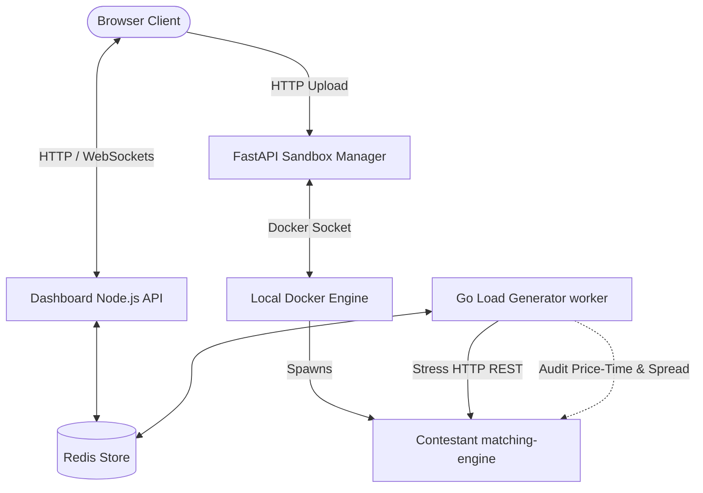

# IICPC Distributed Benchmarking and Hosting Platform

A high-performance, containerized, and secure evaluation infrastructure built for the IICPC Summer Hackathon 2026. The platform is designed to securely host contestant-submitted matching engines, stress-test them with a highly concurrent fleet of trading bots, validate execution correctness, and stream real-time results to a live, glassmorphic leaderboard.

---

### Live Public Deployment
The platform is deployed and fully operational on Google Cloud Platform:
* **Public Dashboard URL**: [http://34.173.252.148:3000/](http://34.173.252.148:3000/)

*Note: You can upload the template Go matching engine file located at `templates/go/main.go` to test the container build pipeline, load generator bot fleet, and real-time WebSocket HUD visualization live.*

---

## 1. System Architecture

The platform uses a decoupled, microservices-based architecture orchestrated via Docker Compose (locally) or Kubernetes (in production), with Redis serving as the high-speed message broker and state store.



---

## 2. Key Architectural Features

### 2.1 Go-Powered Concurrency (High-Throughput Bot Fleet)
Rather than relying on resource-heavy testing suites, the Load Generator is built from scratch in Go. Leveraging lightweight Go routines, a single instance can easily simulate thousands of active, concurrent trading bots (Market Makers, Takers, and Noise Traders) generating high-frequency REST traffic with microsecond precision.

### 2.2 Secure Cgroup Sandboxing
Arbitrary contestant submissions are built and deployed inside strictly isolated container sandboxes:
* **CPU Pinning (`--cpuset-cpus="0" --cpu-shares="512"`)**: Restricts the contestant to a single CPU core, preventing runaway loops from locking the host OS.
* **Memory Limits (`-m 256m`)**: Caps memory allocations to prevent RAM exhaustion (OOM kills are caught and flagged on the dashboard).
* **Network Isolation**: Placed on a closed network with zero external outbound access to block reverse shells or data exfiltration.

### 2.3 Real-Time Correctness and Chaos Auditing
The load worker doesn't just calculate speed (TPS/latency); it acts as an Active Correctness Auditor during the stress test:
* **Crossed Book Check**: Periodically inspects orderbook spreads. If Bid >= Ask, a priority violation is logged.
* **Trade Bounds Check**: Validates that matching price execution conforms to limit price boundaries.
* **Adversary Verification**: Probes submissions against negative pricing, integer overflows, and FIFO price-time queue priority.

### 2.4 Cyberpunk Trading Cockpit HUD
Designed with modern HSL tail-color dark modes, glassmorphic panels, and monospace typography reminiscent of professional trading terminals:
* **Live Visual Order Book**: Displays 5 levels of Bid (Buy) and Ask (Sell) depth bars shifting in real-time.
* **Large Price Stat Blocks**: Glowing best bid and ask displays in the HUD.
* **Console Trade Tape**: An auto-scrolling terminal showing real-time matches (MATCH, SUBMIT, CANCEL) as they are handled.

---

## 3. Repository Structure

```directory
.
├── ARCHITECTURE_BLUEPRINT.md            # In-depth architectural design blueprint
├── Makefile                             # Shortcut commands for orchestration
├── README.md                            # Project documentation
├── docker-compose.yml                   # Local multi-container compose topology
├── templates/
│   └── go/
│       ├── main.go                      # Reference Matching Engine template (Go)
│       └── Dockerfile                   # Contestant build instructions
├── sandbox-manager/
│   ├── main.py                          # FastAPI Container Sandboxing Daemon (Python)
│   ├── requirements.txt                 # Python dependencies
│   └── Dockerfile                       # Sandbox manager build instructions
├── load-generator/
│   ├── main.go                          # High-throughput Bot Fleet & Ingester (Go)
│   ├── go.mod                           # Go modules config
│   ├── go.sum                           # Go modules lockfile
│   └── Dockerfile                       # Load generator build instructions
├── dashboard/
│   ├── server.js                        # Express WebSocket Server
│   ├── package.json                     # Node.js dependencies
│   ├── Dockerfile                       # Dashboard server build instructions
│   └── public/
│       ├── index.html                   # Dashboard UI layout
│       ├── index.css                    # Visual design stylesheet
│       └── app.js                       # WebSocket client & Chart.js logic
├── tests/
│   ├── chaos_test.go                    # Automated Correctness & Chaos Test Suite
│   └── go.mod                           # Go modules config for testing
└── iac/
    ├── kubernetes/
    │   └── platform.yaml                # K8s resources for cloud deployment
    └── terraform/
        └── main.tf                      # AWS EKS cluster infrastructure
```

---

## 4. Local Quickstart Guide

Ensure you have Docker Desktop installed and running on your system.

### 4.1 Boot the Platform
Clone this repository, navigate to the folder, and run:
```bash
make up
```
*(This builds all service containers and boots the database, manager, worker, and dashboard).*

### 4.2 Access the HUD
Open your browser and navigate to:
```url
http://localhost:3000
```

### 4.3 Run a Benchmark Demo
1. Under **Submit Code**, enter a team name (e.g., `alpha quantum`).
2. Upload the reference Go matching engine file located in `templates/go/main.go`.
3. Click **Build Submission**. It will build the sandbox image in ~5–10 seconds.
4. Under **Trigger Benchmarking**, select `alpha-quantum` from the dropdown, set your bot count, and click **Launch Stress Test**.
5. Watch the live HUD slide down with scrolling metric charts, depth meters, and trade logs!

### 4.4 Teardown
To cleanly stop the containers and free up local system memory:
```bash
make down
```

---

## 5. Running Chaos and Correctness Tests

We have created an automated integration test suite that acts as an adversary to test the compliance and thread-safety of the running engines.

To run the correctness suite against your active container (no local Go installation required on your host machine):
1. Boot the platform (`make up`).
2. Submit a team named **`team1`** on the web dashboard.
3. Run the following command in your terminal:
   ```bash
   make test-docker
   ```
*(This will boot a Go container, run the suite, check boundary validation, verify FIFO priority, and check for concurrency race double-fills, printing the pass/fail logs to your console).*

---

## 6. Production Cloud Deployment (IaC)

To deploy the platform to a public production environment, the repository includes a complete IaC configuration:
* **Terraform (`iac/terraform/main.tf`)**: Provisions a secure VPC and an AWS EKS Kubernetes cluster with distinct Node Groups (Spot Instances for volatile matching engines, On-Demand for core services).
* **Kubernetes (`iac/kubernetes/platform.yaml`)**: Spawns stateless Load Generator replicas, the Sandbox Manager Daemon, and Load Balancers with ingress routing.
* **Production Sandbox Hardening**: In public settings, Docker socket mounting is replaced by AWS Fargate task creation (powered by AWS Firecracker microVMs) to prevent container escape exploits. Detailed configurations are explained in ARCHITECTURE_BLUEPRINT.md.
