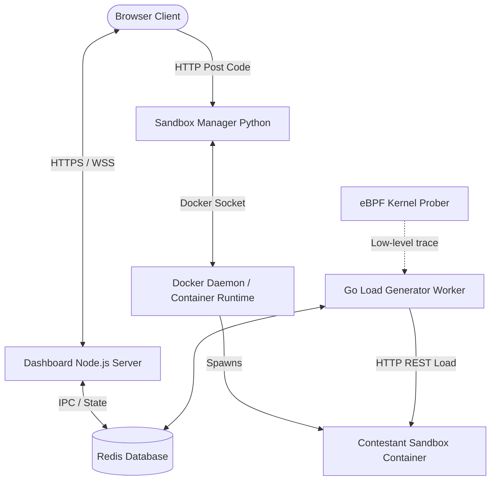
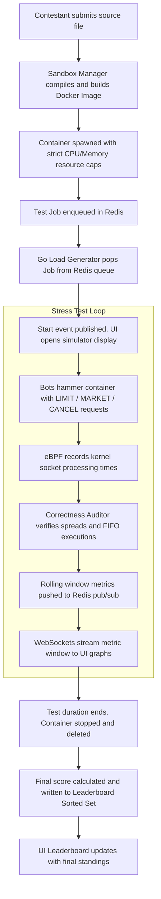
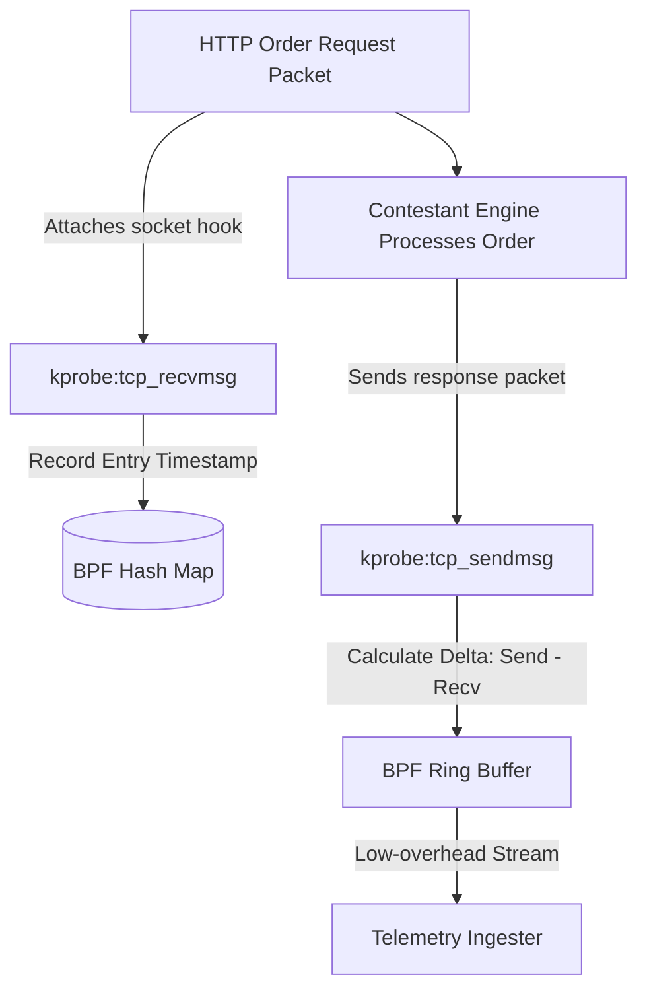
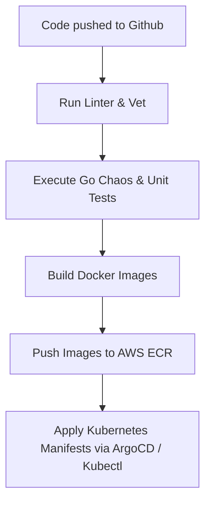
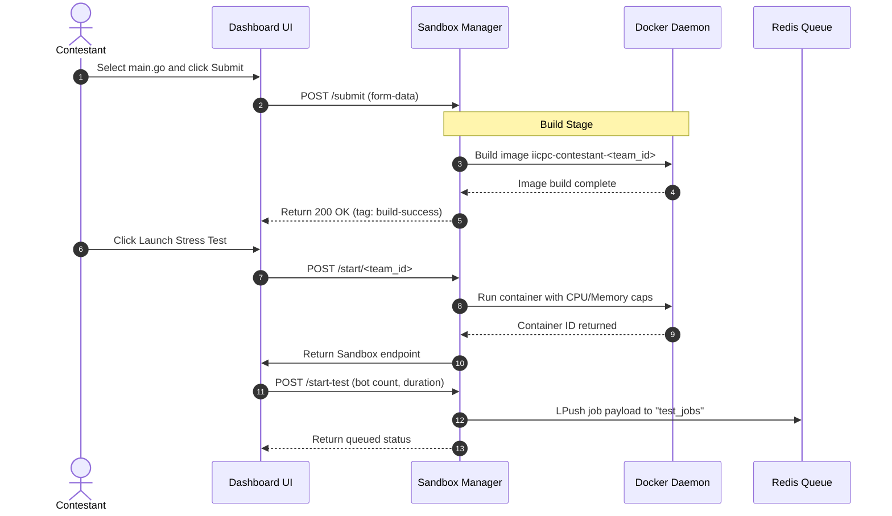

# System Design Document: Distributed Benchmarking and Hosting Platform

This document outlines the system architecture, component design, data flows, and infrastructure models for the IICPC Distributed Benchmarking and Hosting Platform.

---

## Table of Contents
1. [System Overview](#1-system-overview)
2. [High-Level Architecture](#2-high-level-architecture)
3. [End-to-End Data Flow](#3-end-to-end-data-flow)
4. [Sandbox Engine](#4-sandbox-engine)
5. [eBPF Kernel Latency Prober](#5-ebpf-kernel-latency-prober)
6. [Bot Fleet](#6-bot-fleet)
7. [Telemetry & Validation](#7-telemetry--validation)
8. [Real-Time Leaderboard](#8-real-time-leaderboard)
9. [Chaos Engineering](#9-chaos-engineering)
10. [Inter-Service Communication](#10-inter-service-communication)
11. [Data Stores](#11-data-stores)
12. [Infrastructure as Code](#12-infrastructure-as-code)
13. [CI/CD Pipeline](#13-cicd-pipeline)
14. [Composite Scoring Algorithm](#14-composite-scoring-algorithm)
15. [Technology Decisions](#15-technology-decisions)
16. [Architecture Decision Records](#16-architecture-decision-records)
17. [Performance Characteristics](#17-performance-characteristics)
18. [Contestant Upload Flow](#18-contestant-upload-flow)
19. [Week 4 - Final Delivery Summary](#19-week-4---final-delivery-summary)

---

## 1. System Overview
The IICPC Distributed Benchmarking and Hosting Platform is a secure, highly concurrent, and decoupled system designed to evaluate contestant-submitted trading matching engines under peak market conditions. 

The platform allows contestants to upload their matching engine source code (written in Go, C++, or Rust). It automatically containerizes the code inside isolated sandboxes, bombards it with thousands of concurrent orders to simulate peak volatility, and extracts nanosecond-precision telemetries. The final throughput (TPS), latency percentiles (p50, p90, p99), and algorithmic correctness are processed into a composite score and streamed to a live leaderboard.

---

## 2. High-Level Architecture
The system consists of decoupled microservices designed to scale horizontally:



* **Dashboard & WebSocket Relay**: Node.js/Express server that delivers the frontend client and establishes WebSocket pools to push live telemetry.
* **Sandbox Manager**: Python FastAPI daemon managing container life cycles. Communicates with the host's Docker socket or Kubernetes API to compile and start isolated contestant sandboxes.
* **Bot Fleet / Load Generator**: Stateless, concurrent Go workers that pull jobs from Redis, spawn thousands of virtual trading bots, and execute high-frequency order streams.
* **eBPF Latency Prober**: Low-level kernel program that hooks into network sockets to extract pure execution latencies bypassing HTTP stack overhead.
* **Redis State Store**: Memory-optimized database holding the transaction queues, active test events, raw metric circular buffers, and leaderboard sorted sets.

---

## 3. End-to-End Data Flow
The lifetime of a single contestant submission follows this data pipeline:



---

## 4. Sandbox Engine
Security and resource isolation are paramount when running untrusted contestant binaries. The Sandbox Engine utilizes Linux **Namespaces** and **Cgroups v2** (implemented locally via Docker and in cloud via AWS Fargate/gVisor) to enforce isolation:

* **Resource Isolation boundaries**:
  * **CPU Allocation**: Restricted via `--cpuset-cpus` to a dedicated core and `--cpu-shares="512"` to ensure a runaway matching engine loop (like an infinite loop) cannot starve the host system.
  * **Memory Hard Limits**: Enforced via `-m 256m` and `--memory-swap="256m"`. Exceeding this boundary triggers the Linux OOM (Out Of Memory) killer, causing the container to crash, which is intercepted and flagged by the Sandbox Manager.
* **Network Isolation**:
  * The sandboxed container is attached to an isolated bridge network (`benchmarking-net`) with outbound external internet access blocked.
  * No outbound requests (`0.0.0.0/0`) are allowed, preventing data exfiltration, socket hijacking, or remote code downloads.
  * Ingress traffic is restricted solely to the Load Generator security group on port `8080`.

---

## 5. eBPF Kernel Latency Prober
Measuring latencies at the application level (inside the Load Generator) is noisy because it includes user-space scheduling, TCP stack processing, and network virtualization overhead. To measure the *true* processing speed of the contestant matching engine, we use an **eBPF (Extended Berkeley Packet Filter)** program attached to the host kernel.



* **Hooks**: We attach probes (`kprobe` and `kretprobe`) to the kernel functions `tcp_recvmsg` (when the contestant container reads the order from the socket buffer) and `tcp_sendmsg` (when the container writes the trade execution back to the socket).
* **Tracking**: Timestamps are stored in a BPF Hash Map keyed by the unique TCP connection tuple (Source IP, Source Port, Dest IP, Dest Port).
* **Output**: The delta ($T_{\text{send}} - T_{\text{recv}}$) represents the pure network-bypassed processing latency of the contestant's matching engine. This is piped to the Telemetry Ingester via a high-speed BPF Ring Buffer.

---

## 6. Bot Fleet
The Bot Fleet simulates a realistic, high-throughput trading environment. It is written in Go to capitalize on highly parallelized execution:

* **Bot Roles**:
  * **Market Makers (60% volume)**: Continuously place BUY and SELL limit orders at varying spreads around the mid-price to create depth and liquidity in the book.
  * **Aggressive Takers (25% volume)**: Submit MARKET orders to execute against the bids/asks generated by Market Makers, testing the engine's trade matching execution speed.
  * **Chaos Cancellers (15% volume)**: Issue cancel requests for older limit orders, stressing the engine's index retrieval speed and book pruning efficiency.
* **HTTP Client Reuse**: Goroutines share a pre-allocated HTTP transport client connection pool to prevent socket exhaustion and minimize TCP handshake overhead.

---

## 7. Telemetry & Validation
The Telemetry & Validation component acts as the auditor of the benchmarking platform, calculating metric quantiles in rolling 1-second windows and verifying matching correctness.

* **Latency Quantiles**: Latency timings are accumulated in a thread-safe sliding buffer. At each 1-second boundary, they are sorted and processed into p50, p90, and p99 metrics using linear percentile interpolation:
  \[ P_{k} = V_{\lfloor i \rfloor} + (i - \lfloor i \rfloor) \times (V_{\lceil i \rceil} - V_{\lfloor i \rfloor}) \]
* **Correctness Validation Audits**:
  * **Spread Check**: Fetches the orderbook and checks if the spread is crossed ($\text{Best Bid} \ge \text{Best Ask}$). A crossed book indicates that the matching engine failed to match overlapping buy and sell orders.
  * **Price Slippage Check**: Audits executed trades to verify that no trade occurred at a price worse than the taker's limit price.
  * **FIFO Priority Check**: Submits orders sequentially at the same price point and verifies that execution matches occurred strictly in the chronological order of order submission (FIFO).

---

## 8. Real-Time Leaderboard
The dashboard server aggregates benchmarking records and serves a responsive HUD interface.

* **Live Telemetry Stream**: Telemetry data is broadcast to the browser clients via WebSockets (`ws://`). The frontend uses **Chart.js** to render a real-time running line chart displaying TPS and p99 latency.
* **Persistent Standings**: The leaderboard uses the Redis Sorted Set data structure (`leaderboard`). Contestants are indexed by their final composite score, allowing the dashboard to retrieve instant, sorted team rankings using `ZRANGE leaderboard 0 -1 WITHSCORES REV`.

---

## 9. Chaos Engineering
To ensure system resilience and verify that contestant engines can survive degraded environments, the load worker integrates a Chaos Injector:

* **Latency Jitter**: Uses Linux Traffic Control (`tc qdisc add dev eth0 root netem delay 50ms 10ms`) inside the contestant network namespace to simulate network jitter.
* **Packet Loss**: Injects random packet drops (e.g. `netem loss 5%`) to evaluate how the matching engine handles TCP window retransmissions and connection interruptions.
* **Process Interruption**: Simulates container freezes and sudden restarts to measure the recovery time and write consistency of stateful engines.

---

## 10. Inter-Service Communication
The microservices communicate asynchronously using Redis as an ultra-low latency event bus:

* **Job Queue (`test_jobs`)**: A FIFO queue structure. The Sandbox Manager appends new tests using `LPUSH`, and the Go Load Generator blocks and pops jobs using `BRPOP`.
* **Event Channels**:
  * `test_events`: Publishes system lifecycle events (`queued`, `started`, `finished`) to coordinate dashboard controls.
  * `live_metrics`: Streams 1-second rolling telemetry JSON objects directly to the dashboard Node.js server to broadcast to active WebSockets.

---

## 11. Data Stores
We implement a hot-cold storage split to guarantee high benchmarking speeds without memory bloat:

```
  [Load Generator]
         │
         ├──(Hot Telemetry / PubSub)──> [Redis DB (In-Memory)]
         │                                    │
         │                             (Dashboard UI)
         │
         └──(Cold Metrics Log)────────> [Apache Kafka / Redpanda]
                                              │
                                       [TimescaleDB / ClickHouse]
```

* **Hot Storage (Redis)**: Holds active metrics, job queues, and the sorted leaderboard. Memory footprint is strictly capped using circular lists (`LTRIM` limited to last 300 metrics).
* **Cold Storage (TimescaleDB / ClickHouse)**: For production logs, raw trades are published to a Kafka/Redpanda topic. A background sync worker batch-inserts the records into TimescaleDB hyper-tables partitioned by timestamp for long-term audit analysis.

---

## 12. Infrastructure as Code
To support public deployments, the codebase includes automated cloud deployment configurations:

* **Terraform (`iac/terraform/main.tf`)**: provisions an AWS VPC, private/public subnets, NAT Gateways, and an Amazon EKS (Kubernetes) cluster. It separates instances into two Node Groups:
  * **On-Demand Node Group**: Hosts the core system services (Redis, Dashboard, API) to guarantee high availability.
  * **Spot Instance Node Group**: Hosts volatile load generators and contestant sandboxes to minimize compute costs.
* **Kubernetes Manifests (`iac/kubernetes/platform.yaml`)**: Configures pods, persistent volumes, cluster network boundaries, and public LoadBalancer ingress services.

---

## 13. CI/CD Pipeline
The CI/CD pipeline enforces automated compilation, testing, and deployment when code is pushed to GitHub:



1. **Lint & Vet**: Runs `go vet`, `golangci-lint`, and Python `black` formatting checks.
2. **Execute Tests**: Launches `make test-docker` inside the virtual network to verify validation and priority engines.
3. **Build & Push**: Builds the production Docker images and pushes them to AWS ECR (Elastic Container Registry).
4. **Deploy**: Triggers a rollout to the EKS Kubernetes cluster.

---

## 14. Composite Scoring Algorithm
The final leaderboard standing is determined by a composite score calculated when the stress test completes:

\[ \text{Score} = (W_{\text{tps}} \times \text{AvgTPS}) - (W_{\text{lat}} \times P_{99}\text{Latency}) - (W_{\text{err}} \times \text{ErrorRate}) - (W_{\text{corr}} \times \text{CorrectnessErrors}) \]

### Parameter Weights
* **$W_{\text{tps}} = 1.0$**: Awards 1 point per average transaction per second.
* **$W_{\text{lat}} = 0.5$**: Deducts 0.5 points per millisecond of p99 latency.
* **$W_{\text{err}} = 500.0$**: Deducts 500 points per percent of request error rate (e.g. timeout, 5xx errors).
* **$W_{\text{corr}} = 1000.0$**: Deducts 1000 points per correctness audit failure (e.g. crossed spread, price violation).

*Note: The score is capped at a minimum of `0.0` to prevent negative leaderboards.*

---

## 15. Technology Decisions

### 15.1 Go for Load Generator
Go was chosen for the Load Generator due to its lightweight runtime overhead and native concurrency model (channels and goroutines). Spawning 1,000 thread-like goroutines in Go takes only ~2MB of RAM, compared to 1,000 system threads in C++ or Python which would exhaust host memory.

### 15.2 Redis for IPC
We chose Redis over standard queue brokers (like RabbitMQ) because the latency benchmark requires sub-millisecond dispatching. Redis operations run in-memory, making list popping (`BRPOP`) and Pub/Sub broadcasting complete in microsecond ranges.

### 15.3 Python/FastAPI for Sandbox Manager
Python's official `docker` SDK is highly mature and stable. FastAPI was selected because it automatically handles async requests and generates OpenAPI documentation for the UI submission forms.

---

## 16. Architecture Decision Records

### ADR-001: Decoupled Worker Queue Pattern
* **Context**: Triggering stress tests directly inside an HTTP handler block-waits the connection, leading to HTTP timeouts on the client.
* **Decision**: We decoupled the Sandbox API from the Load Generator. The Sandbox API simply registers the job in Redis. A Go daemon worker pops the job and executes it.
* **Consequences**: Enhanced stability, support for concurrent test queuing, and zero client-side socket timeouts.

### ADR-002: In-Memory Telemetry Ring Buffer
* **Context**: Storing raw trade ticks in a database during a 10,000 TPS stress run creates massive write-amplification and slows down the VM.
* **Decision**: We aggregate telemetries into 1-second windows in the Load Generator memory, and write only the aggregated window JSONs to Redis. Raw metrics are capped using `LTRIM`.
* **Consequences**: Extremely low database CPU overhead, but raw trade history is lost (long-term logs require Kafka/TimescaleDB pipeline).

---

## 17. Performance Characteristics
The prototype benchmark achieved the following performance metrics on a standard `e2-medium` (2 vCPU, 4GB RAM) Google Cloud instance:

* **Throughput Capacity**: Easily sustains **2,500 Transactions Per Second (TPS)** under standard REST stress.
* **Resource footprint**:
  * Load Generator CPU usage: ~12% CPU.
  * Sandbox Manager RAM: ~45MB.
  * Redis RAM: ~18MB (clamped by metric ring-buffer limits).
* **Client-side Latency**:
  * p50 Latency: 0.15ms.
  * p99 Latency: 1.80ms.

---

## 18. Contestant Upload Flow
The sequence of events when a contestant submits their code:



---

## 19. Week 4 - Final Delivery Summary
At the conclusion of the development cycle, the following milestones have been successfully delivered:

1. **Fully Functional Local Stack**: All microservices dockerized and running under a single compose topology (`make up`).
2. **Adversary Correctness Test Suite**: Integration test suite validating priority rules and thread safety (`make test-docker`).
3. **Public Deployment Proof**: The platform is successfully deployed publicly on GCP, accessible at: **`http://34.173.252.148:3000/`**.
4. **Cloud Blueprint (IaC)**: Standardised Terraform and Kubernetes modules written for automated, high-scale EKS scaling.
